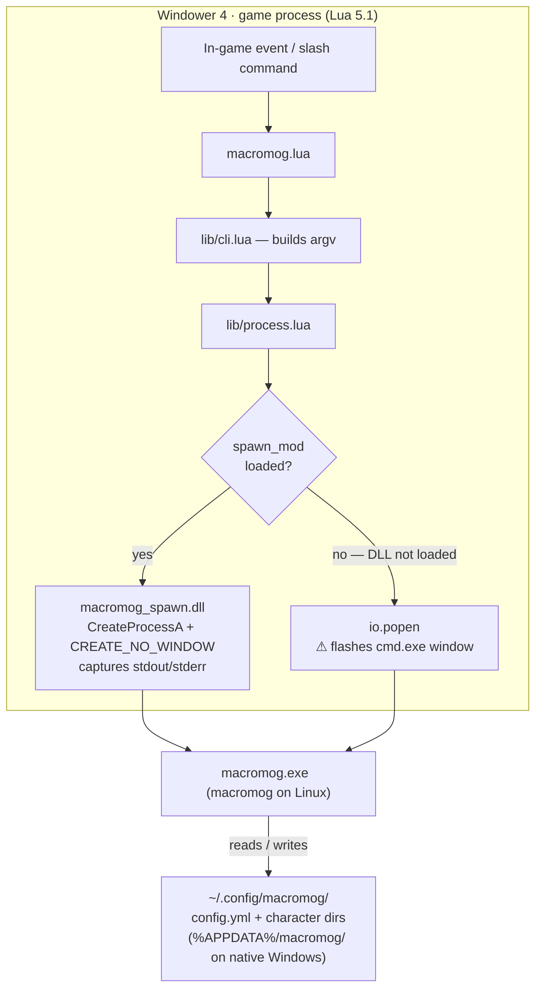

# Architecture

This document explains the three-layer design of Macromog and the constraints
that shaped it.

## Why three components exist

FFXI runs on Windows (or Wine on Linux). Windower 4 extends it by injecting into
the process and exposing a Lua 5.1 sandbox for addons. Each layer of Macromog
lives where it must, no deeper.

| Layer | Language | Where it runs | Why it exists here |
|-------|----------|---------------|--------------------|
| Addon (`macromog.lua`, `lib/`) | Lua 5.1 | Inside Windower 4 | Only Lua addons can read game events (zone, login, command) |
| Spawn DLL (`macromog_spawn.dll`) | C / Win32 | Same process as Windower | Lua 5.1 has no FFI; the DLL is the only way to call Win32 APIs directly |
| CLI (`macromog` / `macromog.exe`) | Go | Separate child process | Keeps all business logic in a standalone tool usable outside the game |

## Why a separate CLI binary

The Go CLI is the heart of the tool — it reads and writes config files, validates
YAML, imports/exports macro books, and manages character slots. Any of this can be
done without FFXI running at all: `macromog list`, `macromog import`, `macromog
export` all work from a terminal with no game open.

The Windower addon handles what the CLI cannot: it binds Windower events (zone-in,
login, slash commands), identifies which character is logged in by mapping their
display name to the hex folder ID the game uses on disk, and dispatches CLI calls
with the right arguments. All conversion, validation, and file I/O logic lives in
the CLI. A user who wants to reorganize their macro books before a gaming session,
write a script to back them up, or add Macromog to a dotfiles setup can do so
entirely through the CLI.

YAML support is a secondary benefit — Lua 5.1 has no production-quality YAML
library, but that would only matter if the addon were trying to parse files itself.
The real reason for the split is that the game client should not be a required
dependency for managing your macros.

## Data flow



## The cmd.exe flash problem

Lua's `io.popen` spawns child processes through `cmd.exe`. On Windows this
creates a console window for a fraction of a second on every CLI invocation —
every zone, login, and macro save triggers a visible flash.

`CreateProcessA` with `CREATE_NO_WINDOW` bypasses cmd.exe entirely and suppresses
the window. The problem is getting there from Lua 5.1.

## Why FFI doesn't work

The common solution is `ffi` (LuaJIT's C-call library), but Windower 4 uses
standard Lua 5.1, not LuaJIT — on every platform, including native Windows
installs. There is no `ffi.dll` Windows system DLL to load; `ffi` is a module
that ships only with LuaJIT. `package.loadlib` and `require` both fail to find it.

The only way to call a Win32 API from inside Windower's Lua sandbox is to load a
native C extension (a `.dll` that exports a `luaopen_*` function).

## Why an addon, not a Windower plugin

Loading a DLL from a non-standard path might look like plugin territory, but the
distinction matters.

**Windower plugins** are C++ DLLs that hook into Windower's plugin system. They
get lower-level access but require more complex integration, cannot be hot-reloaded
without restarting Windower, and must follow Windower's plugin API.

**Windower addons** are Lua scripts. They are sandboxed, hot-reloadable (`//lua
reload Macromog`), and simpler to develop and maintain.

`macromog_spawn.dll` is not a Windower plugin — it is a private Lua C extension
that our addon loads for its own use. Windower's `package.cpath` points to
`plugins/libs/` because that path is for extensions shared across multiple
addons/plugins by convention. Our DLL lives in `bin/` under the addon directory
and is loaded with the full path via `package.loadlib`. It is an implementation
detail, not a publicly registered extension.

The addon stays an addon because the DLL's only job is silent process spawning.
It needs no Windower plugin capabilities beyond what `loadlib` already provides.

## macromog_spawn.dll design

The DLL is a minimal 32-bit Win32 C DLL that exports two Lua 5.1 functions:

| Function | Purpose |
|----------|---------|
| `spawn(bin, args)` | Run a process with `CreateProcessA + CREATE_NO_WINDOW`; return captured output and exit code |
| `file_mtime(path)` | Return the last-write timestamp of a file as a 16-char hex string (used to identify the most-recently-written character DAT on zone) |

It links against `LuaCore.dll` (Windower's Lua 5.1 runtime) using a minimal
import library built from `spawn/LuaCore.def` — only the 11 Lua API symbols
actually used. No Lua SDK is required at build time.

The DLL is loaded via `package.loadlib` with the full path derived from
`windower.addon_path`. This bypasses `package.cpath`, which under Windower points
to `plugins/libs/` rather than the addon directory.

## Character–hex-ID association

FFXI stores each character's macro DAT files under a folder named after their
hex character ID (e.g. `USER\a1b2c3d4\`). The game does not expose the mapping
from character name to hex ID through any accessible API, so macromog discovers
it heuristically via `file_mtime`.

**How it works:**

1. `cli list` returns all character folders under the FFXI `USER` directory.
2. `setup.ensure_character` is called with the logged-in character's name
   (from `windower.ffxi.get_player()`).
3. If only one folder exists, it is used directly.
4. With multiple folders, `pick_char_id` picks whichever has the most-recently
   modified `mcr.dat` — the game updates this file when the character is active,
   so the currently-logged-in character almost always wins.
5. The name→hex-ID pair is written to `config.yml` via `config set-alias` and
   reused on every subsequent login; the heuristic is never run again for that
   character.

**Known limitation — mtime race:**

If you load (or reload) the addon while logged in as character A, but another
character's `mcr.dat` was written more recently (e.g. you ran `//mmog import`
against their folder right before loading), `pick_char_id` may associate the
wrong hex ID with character A's name. The incorrect mapping is then persisted to
`config.yml` and will not self-correct on future loads.

Fix: run `macromog config set-alias <correct-hex-id> <char-name>` to overwrite
the bad entry. This is the intended escape hatch for any mis-registration.

## Why 32-bit Windows and 64-bit Linux

**Windows (`windows/386`):** FFXI is a 32-bit game. Windower hooks into FFXI's
process, which means Windower itself is also a 32-bit process. A 32-bit process
can only load 32-bit DLLs, so `macromog_spawn.dll` must be 32-bit. The CLI
(`macromog.exe`) matches — keeping the entire Windows execution environment
32-bit avoids any cross-architecture subprocess quirks and maximises
compatibility with older Windows and Wine configurations that FFXI players
typically run.

**Linux (`linux/amd64`):** The Linux binary is only used by contributors running
the CLI directly or during CI. Modern Linux is exclusively 64-bit; there is no
32-bit Windower or FFXI process on the Linux side (the game runs under Wine,
which handles the 32-bit Windows environment internally).

## Filesystem paths under Wine / Proton

In practice, FFXI on Linux runs via **Proton** (Steam's Wine fork), though the
path model applies equally to vanilla Wine. The CLI is a Windows PE binary that
Wine executes inside the Wine prefix — it sees a Windows environment but the
Linux filesystem is fully accessible via the `Z:` drive (Wine always maps `Z:\`
to the Linux root `/`).

**Wine detection:** The CLI checks the `WINEPREFIX` environment variable at
startup. If it is set, the CLI knows it is running under Wine/Proton and
activates the host-filesystem path model.

**Linux home resolution:** Wine/Proton sets `WINE_HOST_HOME` to the Linux user's
home directory (e.g. `/home/squatched`). The CLI uses this to locate config
paths on the Linux host.

**Config path:** The CLI honors `XDG_CONFIG_HOME` if set (per the XDG Base
Directory spec), falling back to `~/.config/macromog/`. Under Wine/Proton, the
Linux XDG variables are renamed to `WINE_HOST_XDG_*` form inside the Wine
process, so the CLI checks `WINE_HOST_XDG_CONFIG_HOME` first, then
`XDG_CONFIG_HOME`, then the default.

**Path mapping:** All Linux paths the CLI needs to open are prefixed with `Z:\`
and converted to Windows backslash form for Wine's file API:

```
Linux host path:       /home/squatched/.config/macromog/config.yml
Opened by CLI as:      Z:\home\squatched\.config\macromog\config.yml

Linux host path:       /home/squatched/Games/.../FINAL FANTASY XI/USER
Opened by CLI as:      Z:\home\squatched\Games\...\FINAL FANTASY XI\USER
```

The addon passes no paths to the CLI — it simply invokes `macromog.exe list`,
`macromog.exe export`, etc. The CLI resolves all paths internally based on
`WINEPREFIX` and `WINE_HOST_HOME`.

## Source layout

```
macromog.lua          Entry point; Windower event bindings
lib/
  cli.lua             Argument construction; result parsing
  process.lua         DLL loader; popen fallback
  setup.lua           Character detection on zone/login
  ...
spawn/
  macromog_spawn.c    DLL source (Win32, cross-compiled with mingw-w64)
  helpers.h           Pure-C helpers (push_quoted, mem_copy, filetime_to_hex)
  test_spawn.c        Native Linux unit tests for helpers.h
  LuaCore.def         Minimal import library definition for LuaCore.dll
  build/              Intermediate build artifacts (gitignored)
cmd/
  macromog/           Go CLI entry point
internal/             Go packages (config, dat, export, import, validate, …)
dist/                 All build outputs land here (gitignored)
  Macromog/           Staged addon tree; mirrors the final zip layout
  bin/
    macromog_spawn.dll  Built DLL
  macromog-<version>.zip  Release package (created by make package-plugin)
```

## Testing strategy

Each layer is tested independently using the tools natural to that language:

| Layer | Unit tests | Coverage | Integration |
|-------|-----------|----------|-------------|
| Addon (Lua) | Busted | luacov ≥ 80% | — |
| CLI (Go) | `go test` | go cover ≥ 80% | — |
| Spawn DLL helpers (C) | native gcc + gcov | gcov ≥ 95% | — |
| Spawn DLL Win32 code | — | not measurable natively | Wine or native Windows |

The Win32-specific DLL code (`l_spawn`, `l_file_mtime`) cannot be compiled or
run on Linux, so it is not unit-tested. On **Linux**, `make validate-spawn-smoke`
runs the full addon→DLL→CLI→filesystem round-trip under Wine when Wine is
installed. On **Windows**, run `dist\bin\macromog.exe --help` or load the addon
in Windower directly — no Wine layer needed.
